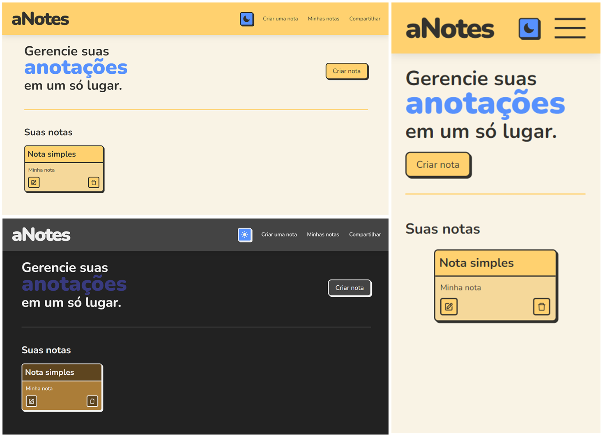

# Projeto aNotes

<a href="https://vinimagaa-anotes.vercel.app/" target="_blank">Clique aqui</a> para visitar o site de projeto em funcionamento.

## Descrição

Este é um projeto completamente feito em React que permite a criação e edição de anotações. Essa é uma nova versão de um projeto já feito por mim com apenas **HTML**, **CSS**, e **JavaScript** que está <a href="https://github.com/ViniMagaa/meus-projetos/tree/main/html-css-js/notas/" target="_blank">neste repositório</a> (confira a <a href="https://vinimagaa.github.io/meus-projetos/html-css-js/notas/" target="_blank">versão web aqui</a>).

A ideia e inspiração principal foi de um repositório que propõe diversos tipos de projetos para programadores praticarem suas habilidades. Caso queira, acesse o <a href="https://github.com/florinpop17/app-ideas" target="_blank">link do repositório</a> ou o <a href="https://github.com/florinpop17/app-ideas/blob/master/Projects/1-Beginner/Notes-App.md" target="_blank">link da proposta do projeto</a>.

## Funcionalidades

- [x] Criar notas
- [x] Selecionar cor da nota
- [x] Editar
  - [x] Editar a cor
- [x] Excluir
- [x] Modo Escuro 🌙
- [x] Salvamento no LocalStorage
