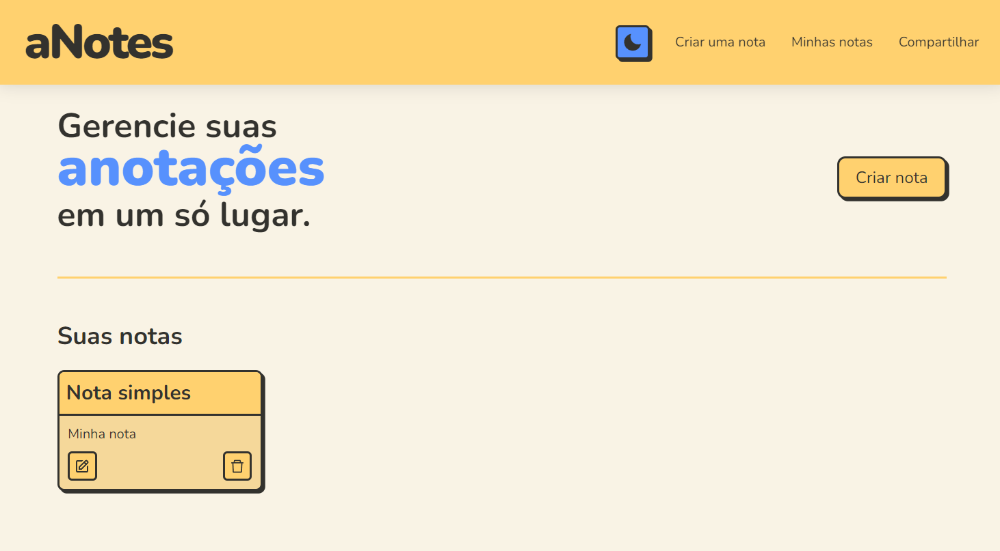
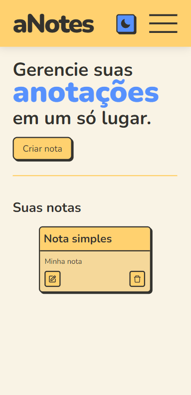
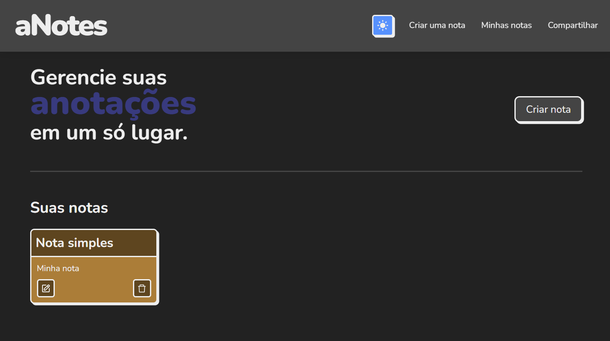

# Projeto aNotes

[Clique aqui](https://vinimagaa-anotes.vercel.app/) para visitar o projeto em funcionamento.

  
  
  

## Descrição

Este é um projeto completamente feito em React que permite a criação e edição de anotações. Essa é uma nova versão de um projeto já feito por mim com apenas **HTML**, **CSS**, e **JavaScript** que está [neste repositório](https://github.com/ViniMagaa/meus-projetos/tree/main/html-css-js/notas/) (confira a versão web [aqui](https://vinimagaa.github.io/meus-projetos/html-css-js/notas/)).

A ideia e inspiração principal foi de um repositório que propõe diversos tipos de projetos para programadores praticarem suas habilidades. Caso queira, acesse o [link do repositório](https://github.com/florinpop17/app-ideas) ou o [link da proposta do projeto](https://github.com/florinpop17/app-ideas/blob/master/Projects/1-Beginner/Notes-App.md).

## Funcionalidades

- [x] Criar notas
- [x] Selecionar cor da nota
- [x] Editar
  - [x] Editar a cor
- [x] Excluir
- [x] Modo Escuro 🌙
- [x] Salvamento no LocalStorage
